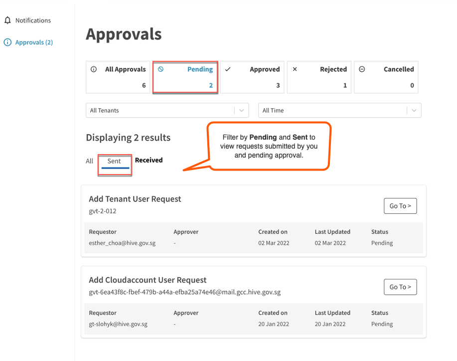
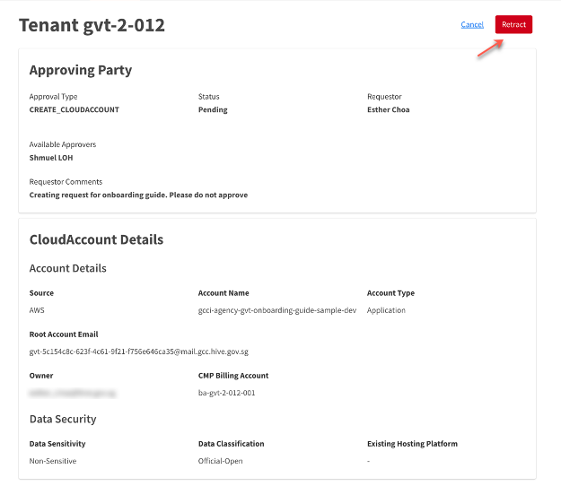
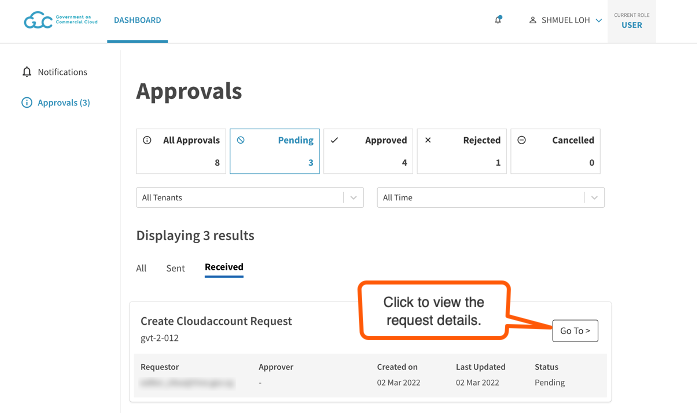
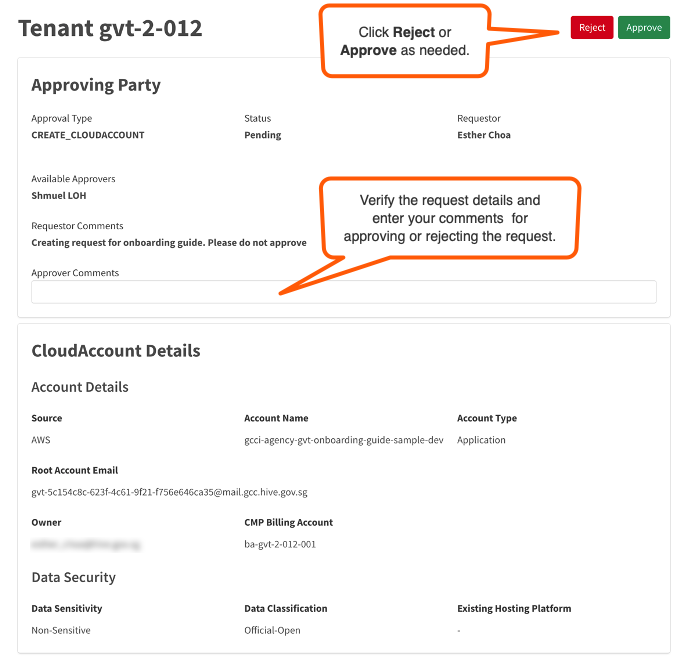

# Create cloud service provider account

**Prerequisite:** Your agency must have a [GCC 2.0 tenant account](create-tenant-account).

Agencies can create and manage their cloud accounts using CMP, and this has the following workflow:

- [Request for a CSP account](#request-for-a-CSP-account)
- [Retract CSP account creation request](#retract-csp-account-creation-request)
- [Approve or reject CSP account creation request](#approve-or-reject-csp-account-creation-request)
- [View CSP account](#view-csp-account)

## Request for a CSP account
Generally, Tenant Admins request for CSP accounts. Tenant Manager can also request for a CSP account provided the tenant account has more than one Tenant Manager so that the other Tenant Manager(s) can be assigned as approver(s) for this request.

> **Important note:** Your cloud account will be pre-setup with certain services and charged accordingly. For example, if you are creating an AWS account, AWS Security Hub will be turned on to meet the security requirements, and you will be charged for it immediately when the account gets created.

**To submit a CSP account creation request:**
1. [Log in to the Cloud Management portal](log-in-to-cmp). The **Dashboard** displays the available tenant accounts.
2. Locate the required tenant account and click **Manage**.
<!--<kbd></kbd>-->
3. Select **CSP** and click **Create New Account**.
5. In the **Create New Account** page, specify the required **Account Details** and click **Next**.

| 
Field Name
  | 
Description
 |
| :------------------------------------------ | :------------- |
| **Source**| Select the required cloud service provider. |
| **Account Name** | While you can specify the required name, the account name will be appended with a prefix and suffix.   For example, if your tenant account belongs to GovTech, and you specify "*test-account*" as the name, *gcci-agency-gvt*, and *-prd* are added as prefix and suffix to this so that the **Account Name** is *gcci-agency-gvt-test-account-prd*. |
| [**Root Account Email**](manage-root-email-mailing-list) | Auto-created mailing list that serves as the root email for the created CSP account. Tenant Admins can manage the recipients in this mailing list on CMP after the cloud account is created. |
| [**CMP Billing Account**](manage-tenant-billing-account) | Tenant Billing Account under which this CSP account will be charged. |
| **Owner** | User who requests for this CSP account. |

6. Fill in required **Data Settings** details and click **Next**.

| 
Field Name
  | 
Description
 |
| :------------------------------------------ | :------------- |
| **Data Sensitivity** | Specify the data sensitivity for the application to be developed or hosted on this CSP account. |
| **Data Classification** | Specify the Data Security classification for the application to be developed/hosted on this CSP account. |
| **Existing Hosting Platform** | If you are migrating your application from a different platform to GCC 2.0, specify it here. If not applicable, leave it blank. |

7. Select the required Tenant Managers as approvers and click **Next**.

> **Note:** Select at least one approver.

8. Make sure the information displayed on this page is correct and click **Submit**.

> **Note:**
>- To edit the details you specified, click the **Back** button on this page.
>- To retract or cancel a CSP account creation request, refer to [Retract CSP account creation request](#retract-csp-account-creation-request).
>- To view the provisioned CSP account, refer to [View CSP account](#view-csp-account).

<!--Tenant Managers and Tenant Admins of a GCC tenant account can view the approved and pending CSP accounts on the **CSP Accounts** page.-->

## Retract CSP account creation request
Requestor may retract a submitted request that is pending approval for the following reasons:
- requested approvers are not available
- requestor wants to assign a different approver
- request is no longer valid.

When you retract a request, you may have to provide a reason for retracting the request and the request status changes from **Pending** to **Cancelled** and will be listed under **Notifications** > **Approvals** > **Cancelled**.

**To retract a CSP account creation request:**
1. [Log in to the Cloud Management portal](log-in-to-cmp).
2. Go to notifications  > **Approvals**.
<kbd></kbd>
3. Select **Pending** and then go to the **Sent** tab to view requests submitted by you and pending approval.
<kbd></kbd>
4. Locate the request you want to retract and click **Go To**.
<kbd></kbd>

> **Note:**
> You can retract requests that are not yet processed by the approvers.

1. Verify the request details and click **Retract**.
<kbd></kbd>

## Approve or reject CSP account creation request

When a Tenant Admin or Tenant Manager submits a CSP account creation request, the Tenant Managers assigned as approvers in the request will be notified via email to process the request.
Approving Tenant Manager reviews the request details before approving or rejecting the CSP account creation.

> **Note:**
> A request is processed if one of the assigned approvers approves or rejects the request.

**To approve or reject a CSP account creation request:**

1. [Log in to the Cloud Management portal](log-in-to-cmp).
2. Go to notifications  > **Approvals**.
<kbd></kbd>
3. Select **Pending** and then go to the **Received** tab to view requests that are waiting your approval.
4. Locate the required CSP account creation request and click **Go To**.
<kbd></kbd>
5. Review the request details and enter your comments in **Approver Comments**.
6. Select **Accept** or **Reject** as needed.
<kbd></kbd>

  The requestor receives an email notification about the approval or rejection. If the request is approved, you can find it in **Notifications** > **Approvals** > **Approved**. If the request was rejected, you can find it in **Notifications** > **Approvals** > **Rejected**.  

  After a request is approved, GCC 2.0 platform provisions the CSP account. After the approval, it may take up to one hour to provision the requested CSP account. When the cloud account is provisioned, the cloud service provider notifies the Tenant Admin.

  After the successful provisioning of the CSP account, the status of this new CSP account changes to **Success**. If the account provisioning failed, the status changes to **Failed**. If the provisioning fails, contact us at gcc2.0_support@tech.gov.sg.

  > **Note:**  After a CSP account is provisioned, the respective cloud service provider may send multiple emails to the Tenant Admin requesting some actions to be completed. You can safely ignore these emails.

## View CSP account
Tenant Manager and Tenant Admin can view and manage users of a CSP account.

**To view CSP accounts:**

1. [Log in to the Cloud Management portal](log-in-to-cmp). The **Dashboard** displays the available tenant accounts.
2. Locate the required tenant account and click **Manage**.
3. Select **CSP** to view the list of cloud accounts for this tenant account.
