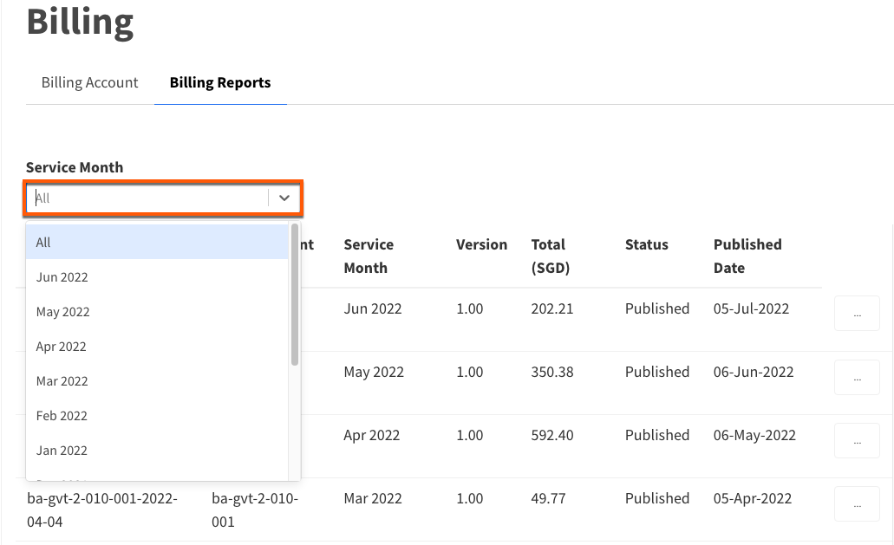
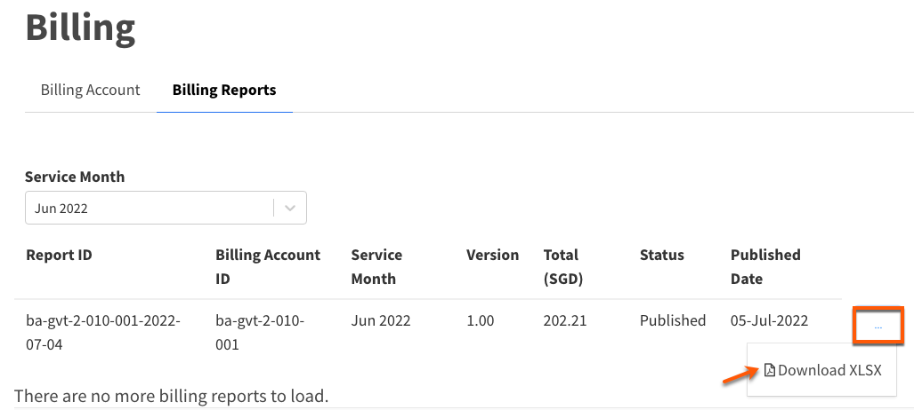
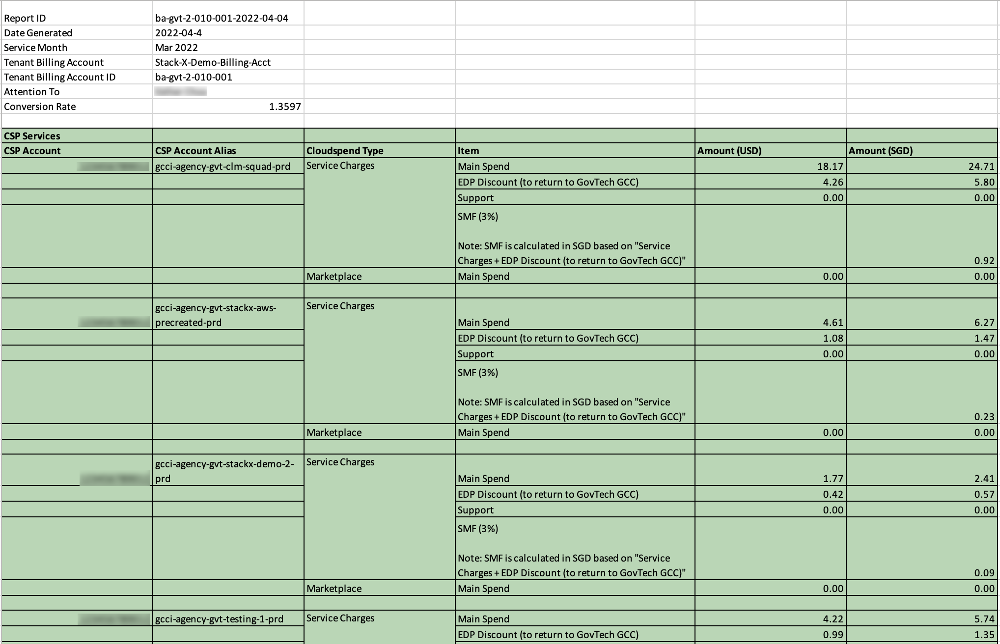
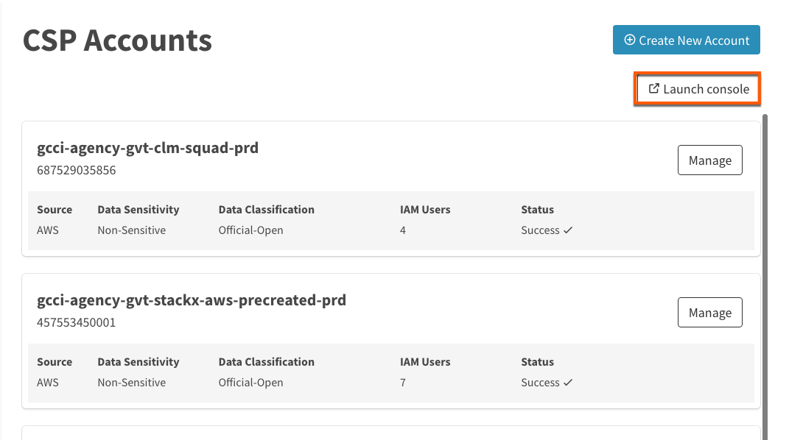
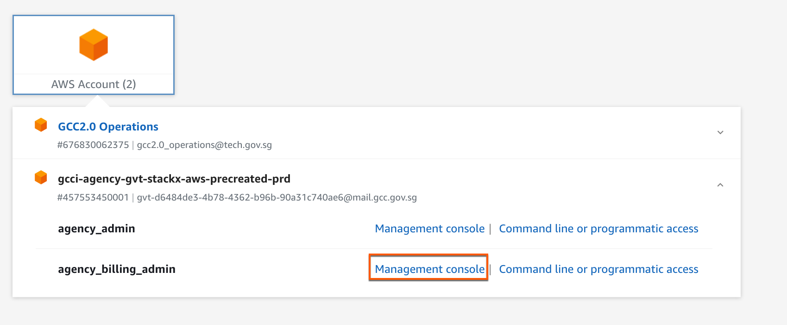
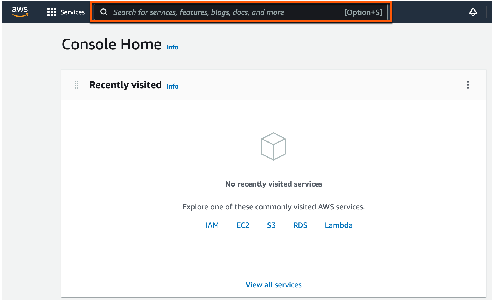
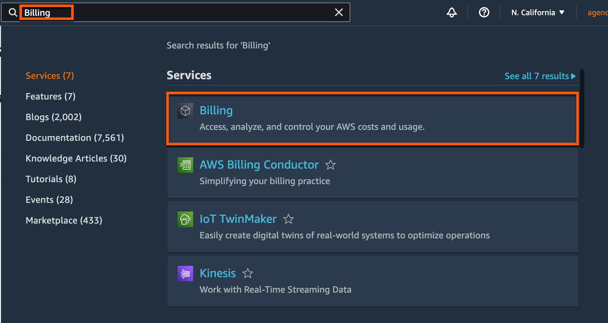
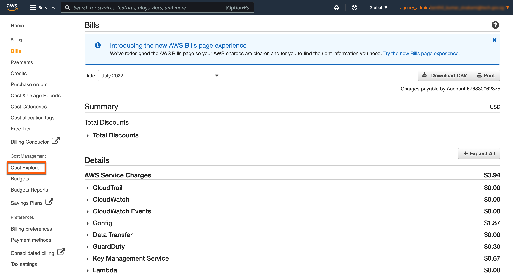
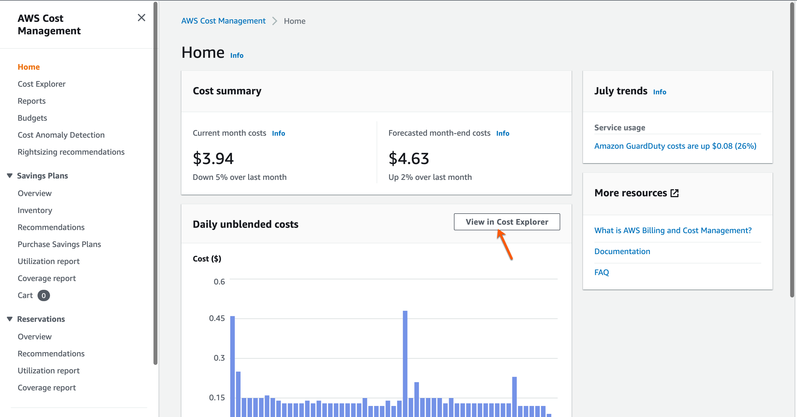
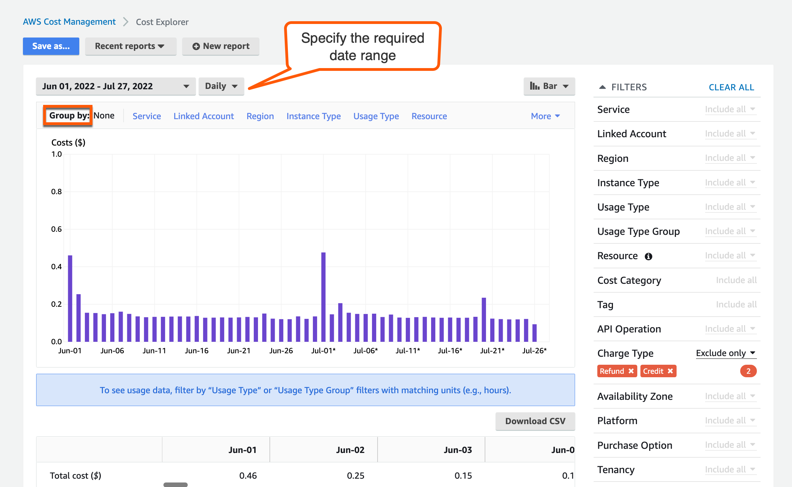

## View billing report

This page helps you understand how to view the billing report for your tenant accounts and validate if the CSP costs associated with the actual cloud usage are accurate.

If there is any discrepancy in the costs listed on the billing report, agencies can raise a dispute with their CSP to resolve them.

If there is no discrepancy in the CSP cost, GovTech will proceed to generate an invoice based on this billing report. Generated invoices will be available by the end of the month, and agencies have a 30-day credit term to complete their payment.

### Prerequisites

To view the GCC billing report for your agency using CMP, you need to be a WOG user with the following roles on the GCC platform.

- Tenant Manager
- Tenant Admin
- Tenant Billing Admin

> **Note:**
>- Users with **Cloud Admin** and **Cloud Billing Admin** roles can access the cost and billing tools available in the cloud console or cloud portal.
>- If needed, your agency can assign a dedicated user as **Tenant Billing Admin** to view the GCC billing report and the **Cloud Billing Admin** role to access the [cost and billing tools](#guidelines-for-csp-cost-analysis-tool).

In this article, you learn how to:

- [View your agency billing report](#view-your-agency-billing-report)
- [Understand GCC billing report](#understand-gcc-billing-report)
- [Guidelines for CSP cost analysis tool](#guidelines-for-csp-cost-analysis-tool)

### View your agency billing report

GovTech publishes the GCC billing report for all the agency GCC tenants between the 10th and 14th of every month on CMP.

>**Note**:
> Billing reports will be available for one year from the generation date.

[Authorised users](#prerequisites) can download the monthly billing report for the agency's GCC tenant accounts from the Cloud Management Portal.

1. [Log in to the Cloud Management Portal](log-in-to-cmp). The **Dashboard** displays the available tenant accounts.
2. Locate the required tenant account and click **Manage**.
<kbd></kbd>
3. On the **CSP Accounts** page, select **Billing**.
<kbd></kbd>
4. On the **Billing** page, select **Billing Reports**.
<kbd></kbd>
5. Go to **Service Month** and select the required month.
> **Note:**
> To view the available billing reports for all the months, select **All**.

  <kbd></kbd>
6. To download the billing report, click the ellipsis icon corresponding to it and then click **Download XLSX**.
<kbd></kbd>

### Understand GCC billing report

GCC billing report shows the cost incurred by all the cloud accounts linked to your GCC tenant account.

The report displays the following information.

| **Billing report attributes** | **Description** |
| :--- | :--- |
| **Report ID** | Unique id of the GCC billing report generated every month. |
| **Date Generated** | Date the report is generated in YYYY-MM-DD format. |
| **Service Month** | Month for which this billing report is generated. |
| **Tenant Billing Account** | Your tenant billing account name. |
| **Tenant Billing Account ID** | Unique ID for this tenant billing account. |
| **Attention To** | Public officer to whom this report is addressed to. While creating the tenant account, the Tenant Manager assigns a public officer to be notified for billing matters. Name of that public officer is displayed here.|
| **Conversion Rate** | Conversion rate as provided by MAS to convert the cost from USD to SGD for the **Service Month**. |
| **CSP Account** | Cloud account ID |
| **CSP Account Alias** | Alias name provided by your agency for this cloud account. |
| **Service Charges** | Service charge of the CSP as displayed on the Bill Details. |
| **EDP Discount (to return to GovTech GCC)** | EDP is the  enterprise discount program offered by your CSP. This discount is entrusted to GovTech as this is a part of the SMF you pay to GovTech GCC service. |
| **Support** | Support cost as charged by the cloud service provider. |
| **Marketplace** | Cost as charged by cloud service provider. |
| **SMF (3%)** | This is the Service Management Fee charged by GCC. It is 3% of your total service charge in SGD + EDP Discount that is entrusted to GovTech. |

<kbd></kbd>

Authorised agency users can [view GCC billing report](#view-your-agency-billing-report). If there is a discrepancy in cloud service utilisation charges, they need to contact their CSP to resolve it.

>**Important**:
> When the discrepancy is resolved, the agency must inform the GCC team via [ITSM](https://itsm.sgnet.gov.sg/sp3) by raising a support request. For more information on how to raise an SR in ITSM, refer to [GCC 2.0 Support](https://docs.developer.tech.gov.sg/docs/gcc-version-2-user-documentation/#/support/raise-an-incident-request).

If a billing report gets updated, its version number gets incremented and is available on the CMP for the authorised users to review.

### Guidelines for CSP cost analysis tool

[Authorised users](#prerequisites) can analyse your cloud service cost using the cost analysis tools provided by your CSP.

In this document, as an example, we explain how to analyse your cloud service usage costs using the [billing and cost explorer tools provided by AWS](#to-use-cost-explorer) and identify any mismatch between our billing report and the actual usage.

> **Note**:
> Refer to [View your agency billing report](#view-your-agency-billing-report).

#### How to use AWS cost explorer

1. [Log in to the Cloud Management Portal](log-in-to-cmp). The **Dashboard** displays the available tenant accounts.
2. Locate the required tenant account and click **Manage**.
<kbd></kbd>
3. Click **Launch console**.

<kbd></kbd>

> **Note**:
> Alternatively, you can access the AWS console from your AWS cloud account.

4. Go to **AWS Account** to view the available cloud accounts.
5. Choose the required cloud account.

<kbd></kbd>

6. Click **Management console**.

<kbd></kbd>

7. In the search box on the navigation bar, enter **Billing**.

<kbd></kbd>

8. Choose **Billing** from the list of search results.

<kbd></kbd>

By default, the console shows the **AWS Billing Dashboard** page. To understand what is displayed on this page, visit [AWS documentation on Billing Dashboard](https://docs.aws.amazon.com/awsaccountbilling/latest/aboutv2/view-billing-dashboard.html).

9. In the navigation pane, choose **Bills**. By default, the current month bill detail is displayed.

<kbd></kbd>

10. Select the required month in **Date**. The **Summary** section displays the details for that month.

<kbd></kbd>

10. To view and understand your cost usage pattern based on required filter criteria, click **Cost Explorer** from the navigation pane.

<kbd></kbd>

11. Click **Launch Cost Explorer**.

<kbd></kbd>

12. On the **AWS Cost Management** page, click **view in Cost Explorer**.

<kbd></kbd>

13. Select the required date range and indicate if you want an hourly, daily, or a monthly breakdown of cost in a graph (line, bar, or stack) for the selected **Group by** filter criterion.

<kbd></kbd>

14. Scroll down below to view the same information in a table format.

> **Note**:
>- There are other filters by which you can customise as needed and view the related cost for the selected date range.
>- For more information, visit [AWS documentation on Cost Explorer](https://docs.aws.amazon.com/cost-management/latest/userguide/ce-what-is.html)
